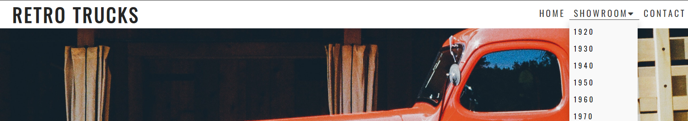

# Retro Trucks.

The primary goal of this site is to give truck enthusiast a place to read and view old trucks and their history between 1920 to 1970.

## The ideal user of this site:
  * Has a big passion for trucks.
  * Is interested in the history of trucks.
  * Is curiouse of how trucks used to look.

## User Stories:
  * As a user i want to know the main purpose of the site directly on arrival.
  * As a user i want to easily find my way on the site.
  * As a user i want to learn new things about trucks.

# Features
  * Navbar
    * Featured on all three pages, the full responsive navigation bar includes links to the Logo, Home page, Gallery and Sign Up page and is identical in each page to allow for easy navigation.
    Except for the showroom navbar where the link for showrrom is a dropdown menu to for the different time periods.
    * This section will allow the user to easily navigate from page to page across all devices without having to revert back to the previous page via the ‘back’ button.

  * Landing page image
    * The landing includes a photograph with text overlay to allow the user to see what the site is about.
    * This section introduces the user to Retro Trucks with an animation to grab their attention.

  * Browse Trucks Section
    * The user will find the different timeperiod links and info about what time periods there are.

  * Contact Link Section
    * the user can from here choose to go to a contact form to get additional information and send questions.

  * Footer and social links.
    * The footer section includes links to the relevant social media sites for Retro Trucks. The links will open to a new tab to allow easy navigation for the user.

# Features left to implement.
  * 

