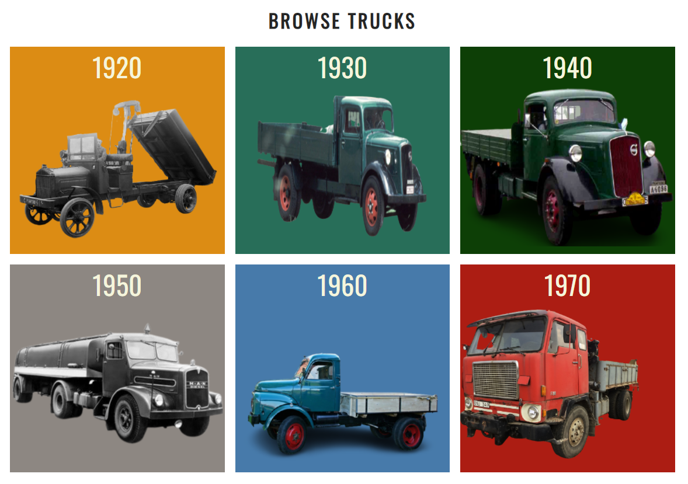

# Retro Trucks.

The primary goal of this site is to give truck enthusiast a place to read and view old trucks and their history between 1920 to 1970. 
This is a place where people can have a interesting, informative and fun time all at once.

## The ideal user of this site:
  * Has a big passion for trucks.
  * Is interested in the history of trucks.
  * Is curiouse of how trucks used to look.
  * Wan´t to know the development from then to now.

## User Stories:
  * As a user i want to know the main purpose of the site directly on arrival.
  * As a user i want to easily find my way on the site.
  * As a user i want to learn new things about trucks.
  * As a user i want to have fun and be compelled to learn more after visiting this site.
  * As a owner i want to get feedback and ideas on how to evolve the site.

# Features
  * Navbar
    * Featured on all three pages, the full responsive navigation bar includes links to the Logo, Home page and contact page and is identical in each page to allow for easy navigation.
    Except for the showroom navbar where the link for showrrom is a dropdown menu to for the different time periods.
    * This section will allow the user to easily navigate from page to page across all devices without having to revert back to the previous page via the ‘back’ button.

  * Landing page image
    * The landing includes a photograph with text overlay to allow the user to see what the site is about.
    * This section introduces the user to Retro Trucks with an animation to grab their attention.

  * Browse Trucks Section
    * The user will find the different timeperiod links and info about what time periods there are.

  * Contact Link Section
    * the user can from here choose to go to a contact form to get additional information and send questions.

  * Footer and social links.
    * The footer section includes links to the relevant social media sites for Retro Trucks. The links will open to a new tab to allow easy navigation for the user.

  * Contact Page
    * This page give the users a way to contact the siteowner and ask questions and make requests for other information.

# Features left to implement.
  * hamgurger menu for the navbar
  * More pages of the history of trucks
  * Newsletter
  * For members section

# Testing.
  * The site is funtioning as intented and in all screen sizes.
  * The navigation of the site is easy to follow and the users finds the flow easy to follow.
  * Tested in chrome and edges dev tools.
  * multiple users have test run the site for me with great feedback.

## Validator testing.
  * HTML
    * No errors were returned when passing through the official [W3C validator](https://validator.w3.org/nu/)
  * CSS
    * No errors were found when passing through the official [Jigsaw validator](https://jigsaw.w3.org/css-validator/)

# Bugs
  * Nothing speciel more than usual design and style issues that i resolved with help from others in slack and stackoverflow etc.
  * hamgurgermenu did i not succeed in making and the time ran out before deployment so will be in features left to implement.

# Deployment Steps.
  * The site was deployed to GitHub pages. The steps to deploy are as follows:
  * In the GitHub repository, navigate to the Settings tab
  * From the source section drop-down menu, select the Master Branch
  * Once the master branch has been selected, the page will be automatically refreshed with a detailed ribbon 
    display to indicate the successful deployment.

The live link can be found here - https://gorsig.github.io/retro-trucks/index.html

# Credits.
## Content
  * The icons was taken from [Font Awesom](https://www.fontawesome.com)
  * The how to make forms was implemented from [CodeInstitute](https://codeinstitute.net/)
  * The fonts was taken from [Google Fonts](https://fonts.google.com/)
  * The how to make flexbox was implemented from [w3schools](https://www.w3schools.com/)
  * The navbar stay on top when scroll was taken from [w3schools](https://www.w3schools.com/)
  * Some of the code for hero img and animation and some css code was implemented from the Love Running Project  
    from [CodeInstitute](https://codeinstitute.net/)
  * Text in "cover texts" over the hero images are mostly citations from [Volvo](https://www.volvotrucks.com/en-en/about-us/history)

## Media
  * The photos for the homepage was taken from variouse places...mostly free to use, if not all then since it is not for commercial use it is ok to use those images and texts i have been told.
    * [Pinterest](https://www.pinterest.com)
    * [Pexels](https://www.pexels.com)
    * [Pixabay](https://pixabay.com/)
    * [Volvo](https://www.volvotrucks.com/en-en/about-us/history)
    * [Mack](https://www.macktrucks.com/about-mack/museum/mack-history)

## Other help.
  * My mentor was a big help and gave me a lot of good advice.
  * I had a lot of help via the slack community.
  * Sites as, stackoverflow, w3schools, CSS-Tricks was also a big help.
  * And of course all that i have learned from the CodeInstitute course made this happen.